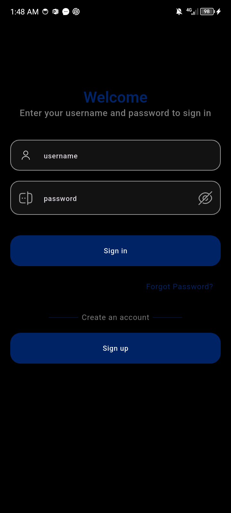
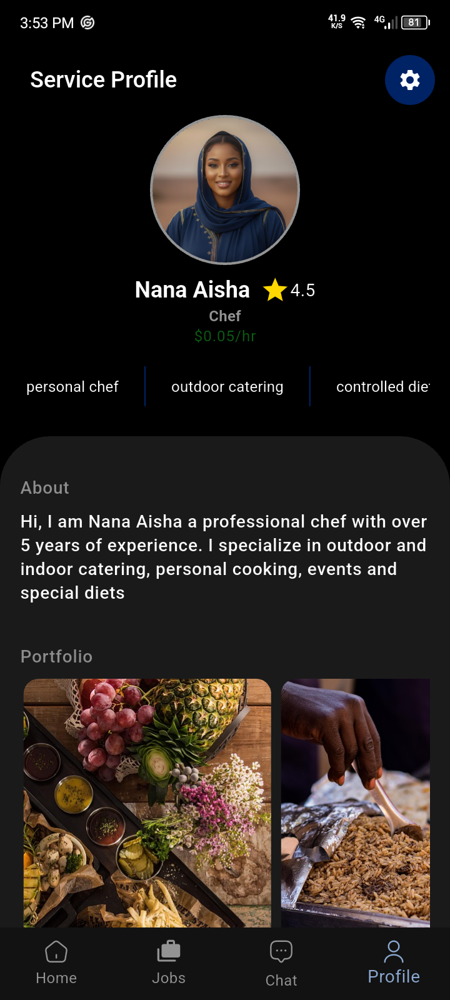

# Vider Provider

**Vider Provider** is a freelancer app that connects service providers with clients in their location.  
This app is used by service providers to:

1. Display their portfolio along with their current location.  
2. Exchange text messages with clients.  
3. Accept job offers.  
4. Receive payment in crypto after completing each job.  

The app is built with **Flutter** for the frontend, **Node.js** for the backend, and **MongoDB** for data storage.

---

## Download APK (Beta)

If you want to try the Android app quickly, download the latest APK:

[](https://drive.google.com/drive/folders/1dWddvh0wEG59eH0ZC3gdfpZAK6wdE_uT?usp=sharing)

You can also check out the Vider Repository:

[Vider](https://github.com/ahmvddddd/vider)
Companion app for clients to search for providers, send job requests and make payments.

---
## Quick Start Guide

1. **Sign Up / Log In**  
   - Create an account by submitting all required details or log in using your existing credentials.  

2. **KYC**  
   - Complete all KYC and OTP verification after signing in.

3. **Update Your Portfolio**  
   - Fill in all portfolio data and make sure to submit attractive portfolio images to attract clients.  

4. **Accept Job Request**  
   - Check your notifications by tapping the notification icon on the top right corner of the home screen to view and accept job requests.  

5. **Send Job Request**  
   - Enter your **transaction PIN** and send a job request with details like job type, duration, and pay.   

6. **Job in Progress**  
   - Track the job’s status in the **Jobs screen** (active jobs appear at the top with a timer). Await notification to signal job completion.  

7. **Review Dashboard**  
   - Check your dashboard for updates on your **total earnings** and **average job duration**.     

8. **Payment**  
   - Once the job is completed, payment will be deposited in your wallet. Navigate to the settings screen and make withdrawals.  

---

## Data Flow

A simple diagram of how the app works:


---

## Architecture

The app follows a **Model–View–Controller (MVC)** software architecture:

- **Models**  
  Represent the data and business logic of the application.  
  Examples:  
  - `user_model` (username, lastname, etc.)  
  - `job_model` (duration, status, etc.)  

- **Views**  
  Represent the **UI elements** visible to the user.  
  Examples: Login screen, Dashboard, Job listings.  

- **Controllers**  
  Handle user input, process requests, and decide what data from the Model goes to the View.  
  Example: `transaction_controller` fetches transactions from the backend and displays transaction details in the transaction history screen using the `transaction_model`.  

 All **state management** logic is handled using **flutter_riverpod**.  

---

##  Screenshots & Features

###  Authentication
- Sign In and Sign Up screens include all required form fields.  
- All input values are validated before submission.  
- Authentication tokens are stored securely.

<p align="center">


</p>

###  Dashboard
- Displayed after login.  
- Shows the **total amount earned** by the provider since joining.  
- Includes a **job heatmap** and **average job duration** statistics.


###  Jobs
- Displays all jobs, with **active jobs pinned at the top**.  
- Includes a **timer indicator** to show remaining time for active jobs.
- Accept job screen displays the location where the service will be rendered and all job details.

<p align="center">


</p>

###  Chat & Messaging
- Chat screen lists all client conversations with **unread indicators**.  
- Instant messaging powered by **sockets**.  
- Integrated with **Firebase Cloud Messaging (FCM)** so providers never miss messages or job updates.  

<p align="center">


</p>

###  Profile & Settings
- Profile screen previews how the provider’s portfolio appears to clients.  
- Settings screen provides access to:  
  - Wallet (balance + token withdrawals).  
  - Location toggle (visible/invisible to clients).  
  - App and profile customization options.  

<p align="center">


</p>
---

##  Tech Stack
- **Frontend:** Flutter  
- **Backend:** Node.js  
- **Database:** MongoDB  
- **State Management:** Riverpod  
- **Messaging/Notifications:** WebSockets & Firebase Cloud Messaging  
- **Payments:** Crypto-based payments  

---

## Developer Guide — Clone & Run

### Prerequisites
- Flutter SDK (stable channel) and Android SDK
- A GitHub account (for cloning/pushing)
- Optional: `flutter_dotenv` for environment variables in Flutter

1. Clone the repository and navigate to the project directory:
```
   git clone https://github.com/ahmvddddd/vider_provider.git
```

```
cd vider_provider
```

2. Install dependencies
Run the following command to fetch all the packages:
```
flutter pub get
```

3. Run the app
Make sure a device or emulator is running, then execute:
```
flutter run
```

4. Build APK (Android)
To build a release APK:
```
flutter build apk
```
Build for iOS (MacOS only)
To build the app for iOS:
```
flutter build ios
```

5. Troubleshooting
Run flutter doctor to check for setup issues:
```
flutter doctor

```

To clean the build:
```
flutter clean
flutter pub get
```
